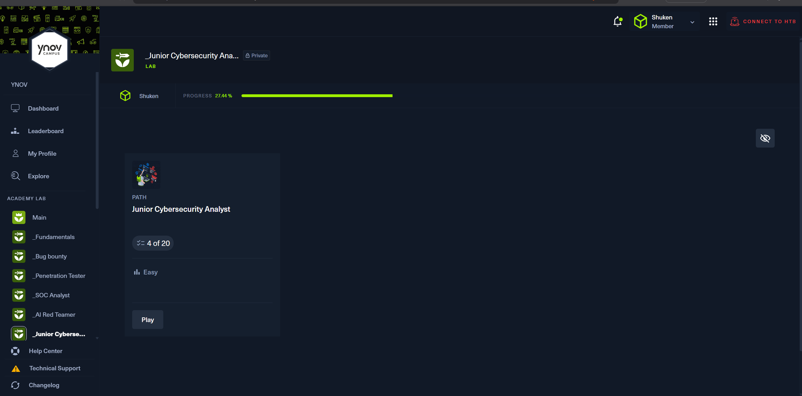

THOMAS DYLAN

**Date** : 12/11/2025  

**Durée** : 7h30  

**Machines/Exos** : Modules théoriques et pratiques sur Hack The Box  

## Objectifs de la session
- Terminer le module **Introduction to Networking**  
- Commencer et terminer le module **Linux Fundamentals**  

## Synthèse de la séance
Durant cette séance, j’ai travaillé sur les modules suivants :  

- **Introduction to Networking** :  
  - J’ai étudié les concepts de base des réseaux, notamment les VPN, les VLAN, les mots clés essentiels du réseau, ainsi que les différents protocoles de communication, comme ICMP.  

- **Fondamentaux Linux** :  
  - J’ai exploré l’arborescence du système Linux, compris les chemins possibles et appris les commandes de base telles que `ls`, `chmod`, `cat`, `mkdir`, `nano`, `ufw` ,`cron`.  

La séance a combiné théorie et premières manipulations pratiques.  

## Résultats
- **Introduction to Networking** : terminé  
- **Linux Fundamentals** : terminé  

## Leçons / Notes techniques
- `remember/Networking Key Terminology.md`  
- `remember/Linux Fundamentals.md`  

## Difficultés rencontrées
- Compréhension du concept de VLAN 

## Prochaines étapes
- Revoir et consolider les concepts vus aujourd’hui  
- Poursuivre les modules suivants de la certification
