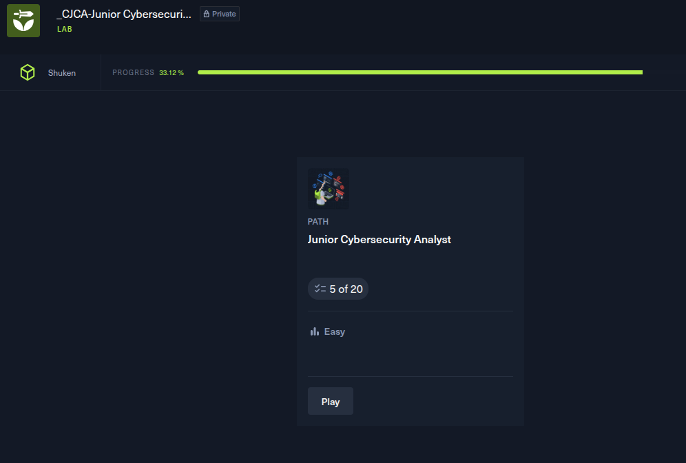

THOMAS DYLAN

**Date** : 03/12/2025  

**Durée** : 7h00

**Machines/Exos** : Modules théoriques et pratiques sur Hack The Box  

## Objectifs de la session
- Terminer le module **Introduction to Bash Scriptind**  
- Commencer **Windows Fundamentals**  

## Synthèse de la séance
Durant cette séance, j’ai travaillé sur les modules suivants :  

- **Introduction to Bash Scripting** :  
  - Durant ce module j’ai appris à manipuler les variables, les boucles et les conditions afin d’automatiser des tâches sous Linux. J’ai notamment développé un script complet utilisant des encodages Base64 successifs, des remplacements de chaînes avec sed, ainsi que le calcul dynamique de valeurs nécessaires à un déchiffrement via OpenSSL. Ce travail m’a permis de comprendre la logique du shell, de résoudre plusieurs erreurs liées à la syntaxe bash et d’exécuter un flux de traitement automatisé jusqu’à l’obtention d'un résultat chiffré.

- **Fondamentaux Windows** :  
  - J’ai ensuite commencé le module Windows Fundamentals. Ce module m’a permis d’aborder les bases du fonctionnement interne des systèmes Windows, dont les différentes versions de l’OS et leurs spécificités, l’organisation du système de fichiers (C:\Windows, C:\Users, Program Files…), ainsi que la gestion des permissions NTFS. J’ai également découvert différentes méthodes d’accès à distance, notamment le protocole RDP, et appris à utiliser des commandes essentielles comme ``Get-WmiObject``, ``icacls``, ``dir`` ou ``tree`` pour explorer et administrer un système Windows. La séance a mélangé théorie et premières manipulations pratiques.  

## Résultats
- **Introduction Bash Scripting** : terminé  
- **Windows Fundamentals** : 57%

## Leçons / Notes techniques
- `remember/Scripting.md`  

## Difficultés rencontrées
- Difficultés avec la syntaxe bash (Je confondais beaucoup avec Python)
- Windows mémorisation des commandes( Commande longue et parfois peu explicite)

## Prochaines étapes
- Revoir et consolider les concepts vus aujourd’hui  
- Poursuivre les modules suivants de la certification
